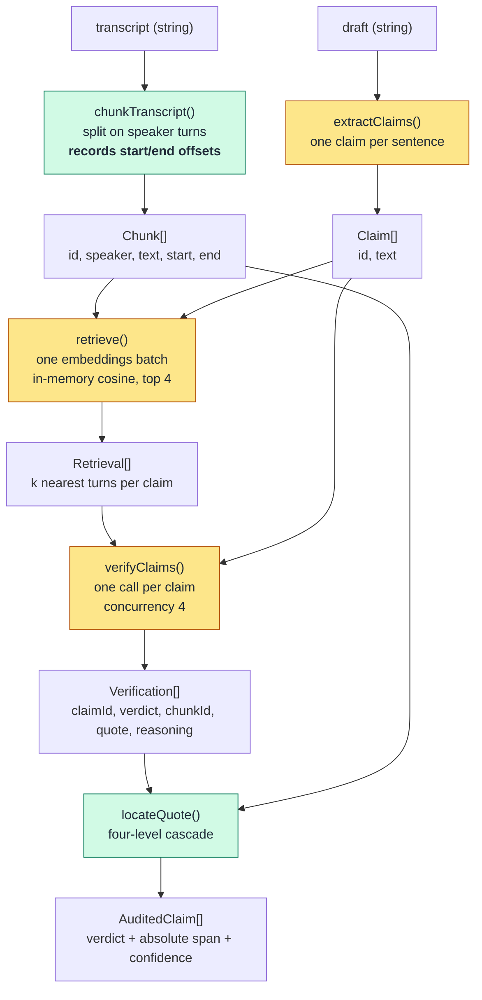

# Architecture

One page, for someone who has ten minutes and wants to know where things live
and which parts are load-bearing.

## The pipeline

Green boxes are deterministic. Amber boxes call a model, so their unit tests
stub `llm.ts` rather than asserting on live output, which would produce a test
that is either fragile or lying. `run.test.ts` stubs the same seam to cover the
whole flow at once.

## Where things live

| Path | What it is |
|---|---|
| `src/lib/pipeline/chunks.ts` | Speaker-turn splitting. Computes the character offsets everything downstream depends on |
| `src/lib/pipeline/claims.ts` | Draft to claims. One model call |
| `src/lib/pipeline/retrieve.ts` | One embeddings batch for claims and chunks together, then cosine ranking |
| `src/lib/pipeline/verify.ts` | One model call per claim, over only that claim's top-k turns |
| `src/lib/pipeline/spans.ts` | Quote to absolute offsets, with a confidence label |
| `src/lib/pipeline/run.ts` | Orchestrates the five stages. No transport concerns |
| `src/lib/llm.ts` | The only file that talks to a provider. Two functions, `complete` and `embed` |
| `src/app/api/audit/route.ts` | Transport. Parses the body, enforces the input size limits, calls `runAudit`, returns JSON |
| `src/components/Auditor.tsx` | The single screen |

`src/lib/pipeline/*` imports nothing from Next.js. That is enforced by
convention rather than tooling, and it is why the pipeline could move into a
different runtime without edits.

## The two invariants

**Offsets are absolute over the original transcript.** Every chunk satisfies
`transcript.slice(chunk.start, chunk.end) === chunk.text`. A span satisfies the
same against its quote only at levels 1 and 2; levels 3 and 4 deliberately
return a region that is wider than the quote, which is exactly what their
`fuzzy` and `chunk` labels declare. `chunks.test.ts` asserts this over every turn of the
fixture. If it ever breaks, the interface highlights the wrong words while
looking completely confident, which is the worst failure this product has.

**The model never returns positions.** It returns a chunk id and a literal
quote. Character indices are computed here, because a model asked for offsets
will invent them fluently.

## The span cascade

`locateQuote()` tries four things in order and labels how it succeeded:

| Level | Method | Confidence |
|---|---|---|
| 1 | `indexOf` of the quote in the chunk | `exact` |
| 2 | Same, with both sides normalised (typographic punctuation, collapsed whitespace, lowercase) | `exact` |
| 3 | Best token-overlap window scoring at least 0.75 | `fuzzy` |
| 4 | The whole turn | `chunk` |

Level 2 carries an index map from each normalised character back to its source
position. Without it, collapsing whitespace changes string length and the
returned offsets would be wrong while still labelled `exact`.

Levels 3 and 4 are drawn with a dashed border in the interface, so an
approximation never looks like a quotation.

## Testing boundary

Four test files, no more, by design:

- `chunks.test.ts` — the offset invariant
- `retrieve.test.ts` — cosine ranking on hand-known vectors
- `spans.test.ts` — the four cascade levels
- `run.test.ts` — the whole pipeline with `llm.ts` stubbed

There are no React component tests and no assertions against live model output.
What replaces the latter is running the fixture against the deployed URL and
reading the verdicts, which is how the instability of one claim and a
sentence-dropping bug were both found. See
[DECISIONS.md](../DECISIONS.md#i-decided) for why that boundary is drawn there.
